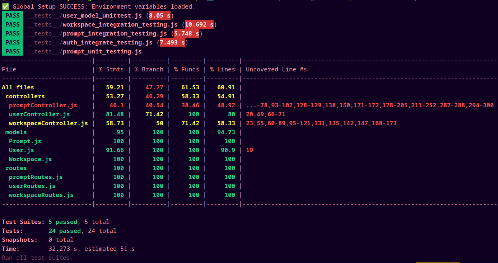

# PROJECT IMPLEMENTATION & TESTING

## Promptly – AI Prompt Management & Workspace System

### Course: Software Engineering Project

### Submitted by:

- **Paritosh Tiwari – IMT2023123**
- **Shivam Pandya – IMT2023091**
- **Parv Sharma – IMT2023514**
- **Krish Kathiria – IMT2023045**

---

# Project Overview

**Promptly** is a full-stack application designed to store, organize, share, and manage AI prompts inside workspaces.  
It includes user authentication, prompt creation, commenting, upvotes, workspace filtering, and modern UI workflows.

**Git Repository:**  
https://github.com/Shivam0Pandya/Promptly_testing.git

---

# Backend

- Node.js + Express REST API
- MongoDB database
- JWT authentication middleware
- CRUD operations for prompts, workspaces & users
- Comments + Upvotes
- CORS + Protected routes

---

# Frontend

- React + Vite
- Login & Register pages
- Dashboard with workspace navigation
- View prompts & prompt details
- Add prompts, comments, upvotes
- Global workspace search
- Responsive UI with TailwindCSS
- LocalStorage token persistence

---

# Setup Instructions

## Clone the repository

git clone https://github.com/Shivam0Pandya/Promptly_testing.git \
cd Promptly_testing

# Backend Setup

cd Backend\
npm install\
npm install mongoose jsonwebtoken express dotenv cors\
npm run dev # or node server.js

## Environment Variables Required

MONGO_URI=mongodb://localhost:27017/promptlydb \
JWT_SECRET=your_secret \
PORT=5000

## Run backend tests

npm install \
npm test

# Frontend Setup

cd Frontend \
npm install \
npm install axios react-router-dom lucid-react \
npm install --save-dev jest @testing-library/react @testing-library/jest-dom @testing-library/
user-event whatwg-fetch
npm install --save-dev @babel/core @babel/preset-env @babel/preset-react babel-jest/ identity-obj-proxy \

## Run frontend tests

npm test \
npm run dev # start UI

# Test Files

## Frontend

Frontend/src/tests/unit/AuthView.test.jsx \
Frontend/src/tests/unit/Sidebar.test.jsx \
Frontend/src/tests/unit/Header.test.jsx \
Frontend/src/tests/integration/AuthFlow.int.test.jsx \
Frontend/src/tests/integration/DashboardFlow.int.test.js

## Backend

Backend/tests/auth.integrate_testing.js \
Backend/tests/prompt_integration_testing.js \
Backend/tests/workspace_integration_testing.js \
Backend/tests/prompt_unit_testing.js \
Backend/tests/user_model_unittesting.js

## Backend Testcases Description

### User Authentication & Profile

| Test Case                               | Description                                  |
| --------------------------------------- | -------------------------------------------- |
| **User Registration (Success)**         | Creates a new user → expects 201 + JWT token |
| **User Registration (Failure: Exists)** | Existing email → 400                         |
| **User Login (Success)**                | Valid login → 200 + JWT token                |
| **User Login (Failure: Invalid Creds)** | Wrong email/password → 401                   |
| **Fetch User Profile**                  | Valid token → returns user (no password)     |
| **Fetch User Profile (No Token)**       | Missing token → 401                          |
| **Fetch User Profile (Invalid Token)**  | Invalid/expired token → 401                  |

### Prompt Management & Versioning

| Test Case                         | Description                                   |
| --------------------------------- | --------------------------------------------- |
| **Create Prompt (Success)**       | New prompt created → 201 and version = 1      |
| **Create Prompt (Missing Field)** | Missing field → 400                           |
| **Get Single Prompt (Success)**   | Fetch valid ID → 200                          |
| **Get Single Prompt (Not Found)** | Invalid ID → 404                              |
| **Submit Update Request**         | Non-owner submits update → 201 pending update |
| **Owner Approves Update**         | Owner approves → 200 and body updated         |
| **Owner Rejects Update**          | Reject → 200 body unchanged                   |
| **Non-Owner Approves Update**     | Unauthorized → 403                            |
| **Upvote Prompt**                 | Upvote increments count                       |
| **Remove Upvote**                 | Removes upvote → decrements count             |
| **Get Prompt History**            | Returns all versions                          |

### Workspace Management

| Test Case                                | Description                                       |
| ---------------------------------------- | ------------------------------------------------- |
| **Create Workspace (Success)**           | Workspace created → 201; creator added to members |
| **User Workspace Update**                | Workspace ID added to User.workspaces             |
| **Join Workspace**                       | Collaborator joins public workspace               |
| **Join Workspace Already Member**        | Should return 200/400                             |
| **Get All Workspaces (Owner)**           | isOwner = true                                    |
| **Get All Workspaces (Collaborator)**    | isOwner = false                                   |
| **Leave Workspace**                      | User removed from workspace & user list           |
| **Owner Deletes Workspace**              | Valid delete → 200                                |
| **Collaborator Delete Workspace (Auth)** | Unauthorized → 403                                |

## Frontend Testcases Description

| Test Case                 | Description                                 |
| ------------------------- | ------------------------------------------- |
| **AuthView**              | Email, password fields & login button exist |
| **Sidebar**               | Displays workspace list                     |
| **Header**                | Search bar exists                           |
| **PromptDetailPage**      | Renders prompt content                      |
| **AuthFlow.int.test.jsx** | Simulates login & saves token               |
| **DashboardFlow.int**     | Navigation + workspace loading              |

## Backend Passing Tests – Terminal Screenshot

md

